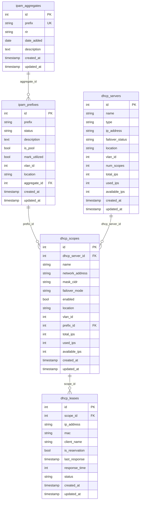

# PRD：IP 管理功能

## 1. 文档版本与修订记录

| 版本 | 日期 | 修订说明 | 作者 |
|------|------|----------|------|
| 0.1 | 2025-03-07 | 初稿：Aggregates / Prefixes / 网络导入 / DHCP 服务管理 | - |

---

## 2. 开发要求（必须遵守）

- **不修改现有其他功能代码**：不改变现有业务逻辑、现有接口的请求/响应语义与现有前端页面。若需在现有模块中增加逻辑（如流程设计器、作业执行），仅做**增量扩展**（如新增表单项、新增分支判断），不删除、不重写现有功能实现。
- **新增字段与表必须通过数据库初始化脚本完成**：所有**新增表**、**新增列**均须通过项目内的 **`netops-backend/int_all_db.py`** 完成初始化；不得仅依赖 Alembic 或其它迁移工具作为唯一创建途径，确保执行 `int_all_db.py` 即可完成 IP 管理相关表结构初始化。

---

## 3. 项目背景与目标

### 3.1 背景

- NetOps 平台需具备 IP 地址与网段管理能力，便于与现有配置管理、设备管理联动。
- 参考 NetBox IPAM 的 Aggregates、Prefixes 模型，做精简后落地到本系统。
- 需支持从 NetBox 迁移数据（Aggregates、Prefixes），并与 Windows DHCP 服务管理在同一入口展示（网络导入页）。
- DHCP 服务管理需支持三级界面：DHCP 服务器列表 → 作用域与 VLAN → 单作用域 IP 列表；并与本系统 Prefixes 关联，便于统一查看网段与 DHCP 使用情况。

### 3.2 目标

- 在配置管理模块下新增「IP 管理」子模块，包含：Aggregates、Prefixes、网络导入、DHCP 服务管理。
- Aggregates / Prefixes 字段对齐 NetBox 精简版（去掉 Children、VRF、Tenant、VLAN、Role 等部分字段）。
- 网络导入页提供 NetBox 迁移接口（读取 NetBox API 导入 Aggregates 与 Prefixes），并与 DHCP 服务器列表同卡展示（DHCP 服务器通过 WMI 读取）。
- DHCP 服务管理实现三级钻取界面，且 DHCP Scope 可与 Prefix 关联。

---

## 4. 名词解释

| 术语 | 说明 |
|------|------|
| **Aggregate** | 顶层 IP 地址块（如 10.0.0.0/8），表示组织管理的 IP 空间根，彼此不能重叠。 |
| **Prefix** | 以 CIDR 表示的网段（如 192.168.1.0/24），可归属某 Aggregate，有状态、描述、VLAN 等属性。 |
| **Scope** | DHCP 作用域，对应一个可分配 IP 的网段，与 Prefix 可做一对一或按 CIDR 关联。 |
| **NetBox IPAM** | NetBox 的 IP 地址管理模块，提供 Aggregates、Prefixes、IP 等模型与 REST API。 |
| **WMI** | Windows Management Instrumentation，用于从 Windows 服务器读取 DHCP 服务器、作用域、租约与保留等信息。 |

---

## 5. 功能范围

- **Aggregates 菜单**：列表、新增、编辑、删除；字段：prefix、rir、date_added、description；校验 Aggregate 之间不重叠。
- **Prefixes 菜单**：列表、新增、编辑、删除；字段：prefix、status、description、is_pool、mark_utilized、vlan_id、location、aggregate_id；支持与 DHCP Scope 关联展示。
- **网络导入菜单**：单页两区域——（1）NetBox 迁移：配置 URL/Token、一键导入 Aggregates 与 Prefixes；（2）DHCP 服务器：列表展示（数据来自 WMI 同步），与图 1 一致。
- **DHCP 服务管理**：三级界面——Level 1 服务器列表（图 1）→ Level 2 某服务器的 Scopes + VLAN（图 2）→ Level 3 某 Scope 的 IP 列表（图 3）；Scope 可关联 Prefix，在 Prefix 详情可查看关联的 DHCP Scope 及使用情况。

---

## 6. 角色与用户故事（可选）

- **网络管理员**：查看/维护 Aggregates、Prefixes；从 NetBox 导入数据；查看 DHCP 服务器与作用域使用情况，并将 Scope 关联到 Prefix。
- **只读用户**：查看 IP 管理各菜单，无新增/编辑/删除与导入权限（权限与现有配置管理模块一致即可）。

---

## 7. 功能详细说明

### 7.1 Aggregates 菜单

- **保留字段**（相对 NetBox 去掉 Children、VRF、Tenant、VLAN、Role）：
  - **prefix**（必填）：CIDR，如 10.0.0.0/8、172.16.0.0/12。
  - **rir**（可选）：分配机构，如 RFC 1918、APNIC。
  - **date_added**（可选）：分配/部署日期。
  - **description**（可选）：描述。
- **业务规则**：同一系统中 Aggregate 的 prefix 之间不能重叠；新增/编辑时校验与已有 Aggregates 无重叠。
- **交互**：列表表格支持按 prefix、rir、description 搜索与筛选、分页；新增/编辑使用 Modal 或 Drawer，提交前做 CIDR 格式与重叠校验。

### 7.2 Prefixes 菜单

- **保留字段**（相对 NetBox 去掉 Children、VRF、Role）：
  - **prefix**（必填）：CIDR。
  - **status**（必填）：如 active、reserved、deprecated、container。
  - **description**（可选）、**is_pool**（可选）、**mark_utilized**（可选）。
  - **vlan_id**（可选）：关联 VLAN，便于与 DHCP Scope 对应。
  - **location**（可选）：位置/站点文本。
  - **aggregate_id**（可选）：所属 Aggregate。
- **业务规则**：prefix 格式合法；若填 aggregate_id，则该 prefix 应在对应 Aggregate 的 prefix 范围内（可选校验）。
- **与 DHCP 关联**：在 dhcp_scopes 表存 prefix_id（或 prefix_cidr）；Prefix 详情/列表可展示「关联的 DHCP Scope」及该 Scope 的已用/可用 IP。

### 7.3 网络导入菜单

- **NetBox 迁移**：
  - 配置：NetBox 基础 URL、API Token（建议存后端配置，不写死在前端）。
  - 操作：用户点击「从 NetBox 导入」→ 后端调用 NetBox API（`GET /api/ipam/aggregates/`、`GET /api/ipam/prefixes/`，分页拉取），映射到本系统字段后写入 ipam_aggregates、ipam_prefixes。
  - 导入策略：全量替换或增量合并，在实现时二选一或可配置（PRD 建议首版支持「增量合并」避免误删本地已编辑数据）。
- **DHCP 服务器**：
  - 数据来源：后端通过 WMI（或 Agent）从 Windows DHCP 服务器读取，同步到本地表 dhcp_servers；列表接口读本地表，支持手动「同步」刷新。
  - 展示：与图 1 一致——DHCP server name、Type、IP address、Failover、Location、VLAN ID、Num. scopes、% IPs used、Total IPs、Used IPs、Available IPs；左侧 FILTERS：Location、Server Type、Status、VLAN ID。

### 7.4 DHCP 服务管理（三级界面）

- **Level 1**：DHCP 服务器列表（图 1）。点击某行进入该服务器的「作用域 + VLAN」列表。
- **Level 2**：某服务器的 Scopes + VLAN（图 2）。列：Scope name、Server name、Failover、Addresses served（进度条）、Address、Mask/CIDR、Enabled、Location、VLAN ID、% IPs used、Total IPs、Used IPs、Available IPs。Scope name / Server name 可点击进入该 Scope 的 IP 列表。
- **Level 3**：某 Scope 的 IP 列表（图 3）。列：Address、Status、MAC、Scope Name、DHCP Client Name、DHCP Reservation、Last Response、Response Time 等。支持「关联到 Prefix」：选择本系统 Prefix，将当前 Scope 与 ipam_prefixes.id 关联。
- **与 Prefixes 关联**：dhcp_scopes 表增加 prefix_id（外键到 ipam_prefixes.id）；Prefix 详情可显示关联的 DHCP Scope 及已用/可用 IP；DHCP Scope 详情可显示关联的 Prefix 并支持跳转。

---

## 8. 与 NetBox 的差异说明（精简字段列表）

| 对象 | NetBox 有、本系统不实现 | 本系统保留 |
|------|------------------------|------------|
| **Aggregate** | Children、VRF、Tenant、VLAN、Role | prefix、rir、date_added、description |
| **Prefix** | Children、VRF、Role | prefix、status、description、is_pool、mark_utilized、vlan_id、location、aggregate_id |

本系统不实现 NetBox 的 VRF、Tenant、Role 等对象本身，仅保留与网段、VLAN、位置相关的精简字段，以满足 IP 与 DHCP 联动管理需求。

---

## 9. 数据模型与 ER 图（表结构 + 关系）

### 9.1 表结构（所有新表/新列均通过 int_all_db.py 初始化）

- **ipam_aggregates**  
  - id (PK), prefix (NOT NULL, UNIQUE), rir (VARCHAR), date_added (DATE), description (TEXT), created_at, updated_at (TIMESTAMP WITH TIME ZONE).

- **ipam_prefixes**  
  - id (PK), prefix (NOT NULL), status (VARCHAR NOT NULL), description (TEXT), is_pool (BOOLEAN), mark_utilized (BOOLEAN), vlan_id (INT), location (VARCHAR), aggregate_id (INT FK → ipam_aggregates.id), created_at, updated_at.

- **dhcp_servers**  
  - id (PK), name (VARCHAR), type (VARCHAR, 如 Windows), ip_address (VARCHAR), failover_status (VARCHAR), location (VARCHAR), vlan_id (INT), num_scopes (INT), total_ips (INT), used_ips (INT), available_ips (INT), created_at, updated_at.（可扩展字段按需增加。）

- **dhcp_scopes**  
  - id (PK), dhcp_server_id (INT FK → dhcp_servers.id), name (VARCHAR), network_address (VARCHAR), mask_cidr (VARCHAR), failover_mode (VARCHAR), enabled (BOOLEAN), location (VARCHAR), vlan_id (INT), prefix_id (INT FK → ipam_prefixes.id, 可选), total_ips (INT), used_ips (INT), available_ips (INT), created_at, updated_at.

- **dhcp_leases / dhcp_reservations**（可合并为一张表，用 is_reservation 区分）  
  - id (PK), scope_id (INT FK → dhcp_scopes.id), ip_address (VARCHAR), mac (VARCHAR), client_name (VARCHAR), is_reservation (BOOLEAN), last_response (TIMESTAMP), response_time (INT), status (VARCHAR), created_at, updated_at.

### 9.2 关系示意（Mermaid）

---

## 10. API 列表（端点、方法、主要请求/响应）

统一前缀：`/api/config-module`（与现有配置管理模块一致）。请求走前端 `request.ts` 的 baseURL: `/api`，故前端调用时不写 `/api` 前缀。

| 端点 | 方法 | 说明 | 主要请求/响应 |
|------|------|------|----------------|
| `/config-module/ipam/aggregates` | GET | 列表，支持 prefix、rir、description 筛选与分页 | Query: skip, limit, prefix, rir, description. Response: items[], total |
| `/config-module/ipam/aggregates` | POST | 新增 Aggregate | Body: prefix, rir?, date_added?, description?. Response: 单条 |
| `/config-module/ipam/aggregates/{id}` | GET / PUT / DELETE | 详情 / 更新 / 删除 | PUT Body 同 POST |
| `/config-module/ipam/prefixes` | GET | 列表，支持 prefix、status、vlan_id、aggregate_id、location 筛选与分页 | Query: skip, limit, prefix, status, vlan_id, aggregate_id, location. Response: items[], total |
| `/config-module/ipam/prefixes` | POST | 新增 Prefix | Body: prefix, status, description?, is_pool?, mark_utilized?, vlan_id?, location?, aggregate_id?. Response: 单条 |
| `/config-module/ipam/prefixes/{id}` | GET / PUT / DELETE | 详情（可含关联 DHCP Scope）/ 更新 / 删除 | PUT Body 同 POST |
| `/config-module/import/netbox-config` | GET / POST | 读取/保存 NetBox 配置（URL、Token） | POST Body: base_url, api_token |
| `/config-module/import/netbox` | POST | 触发从 NetBox 导入 Aggregates 与 Prefixes | Body 可选: strategy=merge|replace. Response: 导入结果统计 |
| `/config-module/dhcp/servers` | GET | DHCP 服务器列表，支持 Location、Server Type、Status、VLAN ID 筛选 | Query: skip, limit, location, server_type, status, vlan_id. Response: items[], total |
| `/config-module/dhcp/servers/{id}/scopes` | GET | 某服务器的 Scopes 列表 | Response: items[], total |
| `/config-module/dhcp/scopes/{id}` | GET | Scope 详情（含关联 Prefix 信息） | Response: 单条 + prefix 信息 |
| `/config-module/dhcp/scopes/{id}/ips` | GET | 某 Scope 的 IP 列表（租约 + 保留） | Query: skip, limit, status. Response: items[], total |
| `/config-module/dhcp/scopes/{id}/link-prefix` | POST | 将 Scope 关联到 Prefix | Body: prefix_id. Response: 更新后 Scope |
| `/config-module/dhcp/sync` | POST | 触发从 WMI（或 Agent）同步 DHCP 数据到本地表 | Response: 同步结果 |

---

## 11. 前端页面与路由结构

- **菜单位置**：配置管理（`config-module`）下新增「IP 管理」子菜单；与配置摘要、配置管理、合规检查、服务终止并列。
- **路由建议**：
  - `/config-module/ip-management`：IP 管理入口（可重定向到 dhcp 或 aggregates，按产品默认页定）。
  - `/config-module/ip-management/aggregates`：Aggregates 列表与增删改。
  - `/config-module/ip-management/prefixes`：Prefixes 列表与增删改。
  - `/config-module/ip-management/import`：网络导入（NetBox 迁移 + DHCP 服务器同卡）。
  - `/config-module/ip-management/dhcp`：DHCP 服务器列表（Level 1）。
  - `/config-module/ip-management/dhcp/servers/{id}`：某服务器的 Scopes（Level 2）。
  - `/config-module/ip-management/dhcp/scopes/{id}`：某 Scope 的 IP 列表（Level 3）。
- **实现要点**：在 `Layout.tsx` 的 config-module 的 children 中增加「IP 管理」项；在 `ConfigModule/index.tsx` 中增加 IP 管理子路由及上述 path；新建 IP 管理相关页面组件（Aggregates、Prefixes、Import、DHCP 各级），不修改现有配置摘要/配置管理/合规/服务终止的既有实现。

---

## 12. 非功能需求

- **权限**：与配置管理模块现有权限一致；如需细分，可为「IP 管理-只读」「IP 管理-编辑」「网络导入-执行」等。
- **性能**：Aggregates/Prefixes 列表分页默认每页 20 条；NetBox 导入建议异步或限时，避免长时间阻塞；DHCP 同步建议异步或后台任务。
- **安全**：NetBox API Token 存后端配置或加密存储，不暴露到前端；WMI 访问使用受限账号与最小权限；DHCP 同步接口可做权限与审计。

---

## 13. 测试要点与验收标准

- Aggregates：新增/编辑时 CIDR 格式与重叠校验生效；列表筛选与分页正确。
- Prefixes：新增/编辑时 prefix、status 必填校验；列表展示 aggregate、vlan_id、location；关联 DHCP Scope 后详情展示正确。
- 网络导入：NetBox 配置保存与读取正常；导入后 ipam_aggregates、ipam_prefixes 数据符合预期；DHCP 服务器列表展示与图 1 一致，同步后数据更新。
- DHCP 服务管理：三级页面跳转与数据正确；Scope 关联 Prefix 后，Prefix 详情与 Scope 详情双向展示正确；FILTERS 与表格列与设计一致。

---

## 14. 附录

### 14.1 NetBox API 参考

- Aggregates: `GET /api/ipam/aggregates/`（分页：limit, offset）；返回字段含 prefix, rir, date_added, description 等。
- Prefixes: `GET /api/ipam/prefixes/`（分页与筛选）；返回字段含 prefix, status, description, vlan, 等；映射时忽略 vrf、role、children 等。
- 认证：Header `Authorization: Token <api_token>` 或 `Bearer <token>`（视 NetBox 版本而定）。

### 14.2 WMI 获取 DHCP 的要点

- Windows DHCP 服务器可通过 WMI 类（如 `MSFT_DhcpServer`、`MSFT_DhcpScope`、租约与保留的相应类）或 PowerShell 模块 `DhcpServer` 获取服务器列表、作用域、IP 租约与保留。
- 若 NetOps 后端无法直连 Windows，可采用 Agent 部署在可访问 DHCP 的机器上，定期或按需拉取数据并上报到 NetOps 后端 API，由后端写入 dhcp_servers、dhcp_scopes、dhcp_leases 等表。
